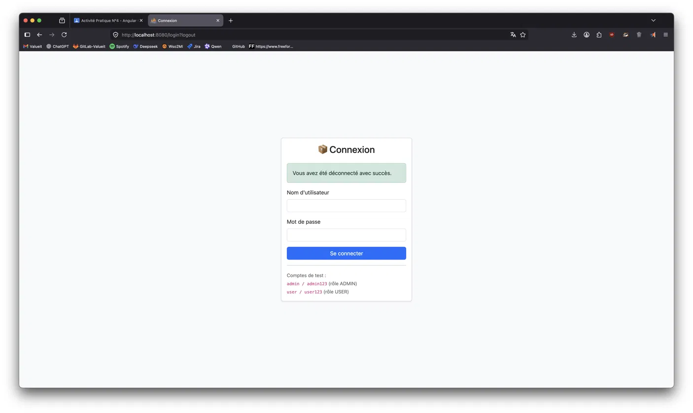
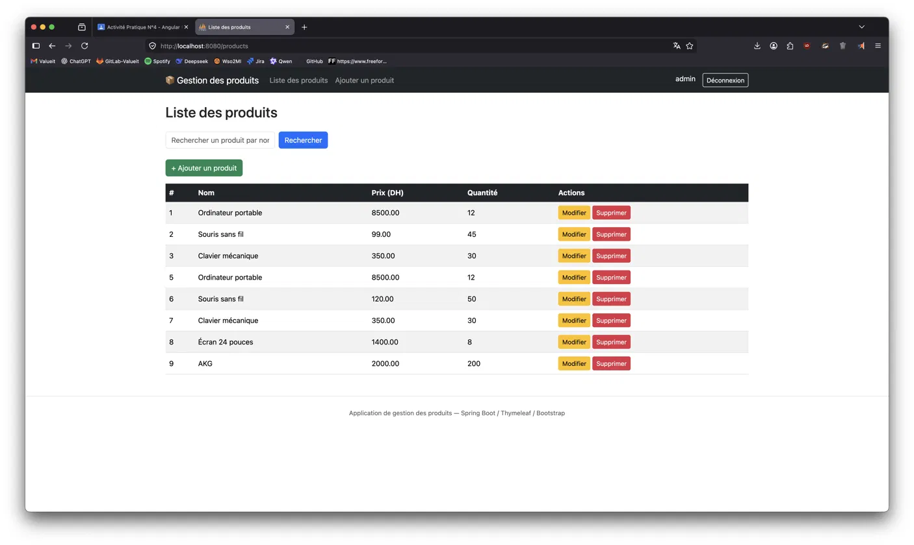
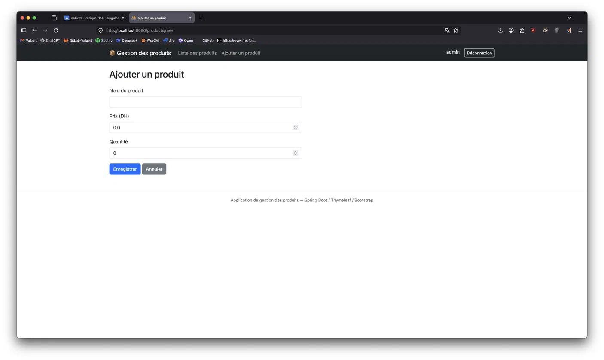

# 📦 Gestion des Produits

Application web de gestion de produits développée avec **Spring Boot**, **Spring Data JPA**, **Spring Security** et **Thymeleaf** (Bootstrap 5).

## Aperçu

| Connexion | Liste des produits | Ajout d'un produit |
|---|---|---|
| Formulaire de login avec comptes de test | Tableau avec recherche, modification et suppression | Formulaire avec validation |

## Fonctionnalités

- ✅ CRUD complet sur les produits (ajout, consultation, modification, suppression)
- ✅ Recherche de produits par nom
- ✅ Validation des formulaires (Bean Validation / Hibernate Validator)
- ✅ Authentification et autorisation avec Spring Security (rôles `USER` / `ADMIN`)
- ✅ Interface responsive avec Bootstrap 5 et un layout Thymeleaf réutilisable
- ✅ Base de données H2 en mémoire pour le développement, migration possible vers MySQL

#
## Comptes de test

| Utilisateur | Mot de passe | Rôle | Droits |
|---|---|---|---|
| `admin` | `admin123` | ADMIN | Consultation, recherche, ajout, modification, suppression |
| `user` | `user123` | USER | Consultation et recherche uniquement |

## Base de données

### Console H2 (développement)

Accessible sur `http://localhost:8080/h2-console` avec :
- **JDBC URL** : `jdbc:h2:mem:productdb`
- **Utilisateur** : `sa`
- **Mot de passe** : *(vide)*

## Sécurité

La configuration Spring Security (`SecurityConfig.java`) définit les règles suivantes :

Les mots de passe sont encodés avec **BCrypt**. Les utilisateurs sont actuellement stockés en mémoire (`InMemoryUserDetailsManager`) ; ils peuvent être remplacés par une table `users`/`roles` en base de données.

"# Activit-Pratique-3" 
